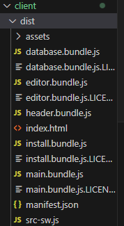
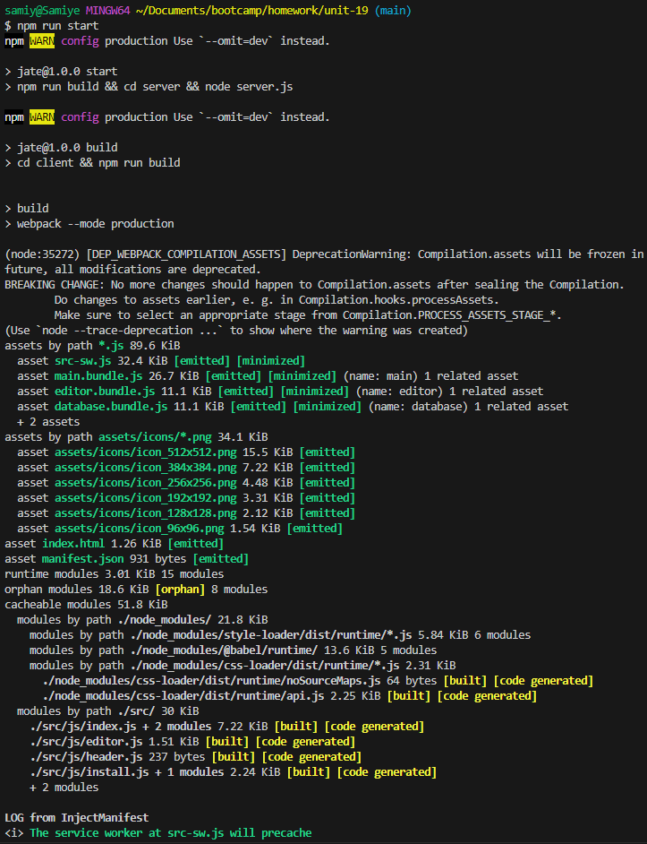
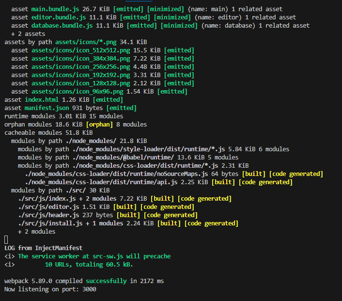

# 19 Progressive Web Applications (PWA): Text Editor


## User Story

```

User WANT to create notes or code snippets with or without an internet connection
SO THAT user can reliably retrieve them for later use
```

## Acceptance Criteria

```md
GIVEN a text editor web application
WHEN user open my application in my editor
THEN user should see a client server folder structure
WHEN user run `npm run start` from the root directory
THEN user find that my application should start up the backend and serve the client
WHEN user run the text editor application from my terminal
THEN user find that my JavaScript files have been bundled using webpack
WHEN user run my webpack plugins
THEN user find that I have a generated HTML file, service worker, and a manifest file
WHEN user use next-gen JavaScript in my application
THEN user find that the text editor still functions in the browser without errors
WHEN user open the text editor
THEN user find that IndexedDB has immediately created a database storage
WHEN user enter content and subsequently click off of the DOM window
THEN user find that the content in the text editor has been saved with IndexedDB
WHEN user reopen the text editor after closing it
THEN user find that the content in the text editor has been retrieved from our IndexedDB
WHEN user click on the Install button
THEN user download my web application as an icon on my desktop
WHEN user load my web application
THEN user should have a registered service worker using workbox
WHEN user register a service worker
THEN user should have my static assets pre cached upon loading along with subsequent pages and static assets
WHEN user deploy to Heroku
THEN user should have proper build scripts for a webpack application
```


## References

*   TAs an Gary helped a lot
*   Module 19 Mini-Project: Deploy Contact Directory App on Heroku with Script
*   Request-Response : The Full-Stack Blog : Heroku Deployment Guide
 

## Preview

The following animation demonstrates the application functionality:





[Deployed Link](https://samiyeahsan.github.io/PWA-textEditer/)